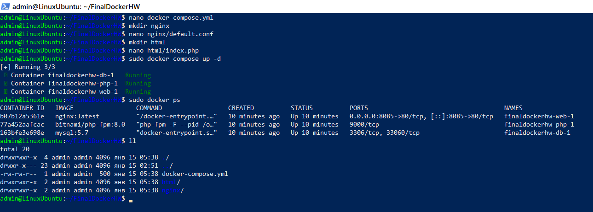
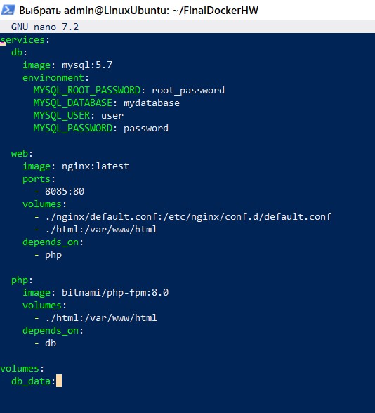
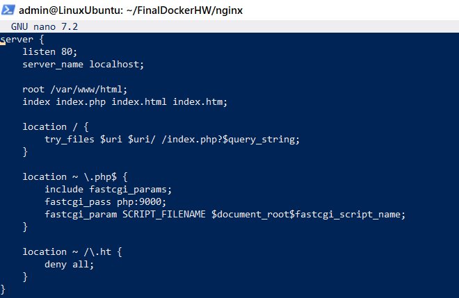
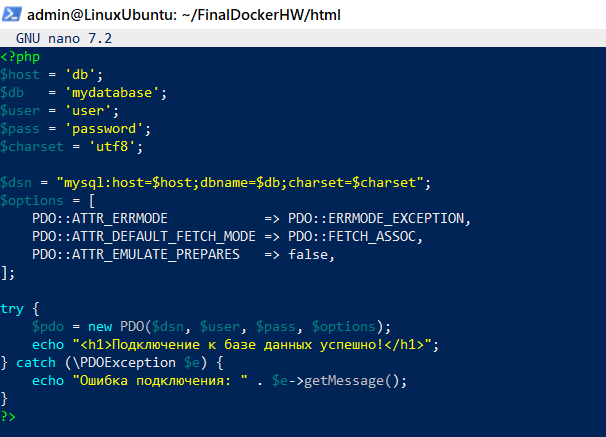

# Docker-Final-Home-Work

## Задание 1:
### 1) создать сервис, состоящий из 2 различных контейнеров: веб, БД
### 2) выводы зафиксировать

<br>


Создаем файл docker-compose.yml:
>nano docker-compose.yml

В файле создаем и настраиваем три сервиса: бд - MySQL, веб - Nginx, язык - php:

```

services:
  db:
    image: mysql:5.7
    environment:
      MYSQL_ROOT_PASSWORD: root_password
      MYSQL_DATABASE: mydatabase
      MYSQL_USER: user
      MYSQL_PASSWORD: password

  web:
    image: nginx:latest
    ports:
      - 8085:80
    volumes:
      - ./nginx/default.conf:/etc/nginx/conf.d/default.conf
      - ./html:/var/www/html
    depends_on:
      - php

  php:
    image: bitnami/php-fpm:8.0
    volumes:
      - ./html:/var/www/html
    depends_on:
      - db

volumes:
  db_data:
```

Для Mysql задаем переменные окружения для создания пользователя и cамой бд, хранение данных.

Для Nginx даем слушать на порту 8085, монтируем локальную папку со статическими файлами и конфигурацию.

Для PHP задаем локальную директорию, чтобы файлы были доступны внутри контейнера.

<br>Создаем папку для конфигурации Nginx:
>mkdir nginx

Там создаем файл default.conf:
> nano nginx/default.conf

В нем добавляем конфигурацию:
```
server {
    listen 80;
    server_name localhost;

    root /var/www/html;
    index index.php index.html index.htm;

    location / {
        try_files $uri $uri/ /index.php?$query_string;
    }

    location ~ \.php$ {
        include fastcgi_params;
        fastcgi_pass php:9000;
        fastcgi_param SCRIPT_FILENAME $document_root$fastcgi_script_name;
    }

    location ~ /\.ht {
        deny all;
    }
}
```

<br>Создаем папку для HTML и PHP файлов:
>mkdir html

Там создаем файл index.php: 
> nano html/index.php

В нем создаем PHP-скрипт: 

```
<?php
$host = 'db';
$db   = 'mydatabase';
$user = 'user';
$pass = 'password';
$charset = 'utf8';

$dsn = "mysql:host=$host;dbname=$db;charset=$charset";
$options = [
    PDO::ATTR_ERRMODE            => PDO::ERRMODE_EXCEPTION,
    PDO::ATTR_DEFAULT_FETCH_MODE => PDO::FETCH_ASSOC,
    PDO::ATTR_EMULATE_PREPARES   => false,
];

try {
    $pdo = new PDO($dsn, $user, $pass, $options);
    echo "<h1>Подключение к базе данных успешно!</h1>";
} catch (\PDOException $e) {
    echo "Ошибка подключения: " . $e->getMessage();
}
?>
```
Он обрабатывает запрос, устанавливает соединение с бд, проверяет соединение и дает HTML ответ.

<br>Из дирректории проекта запускаем Docker Compose:

>sudo docker compose up -d

Проверяем:

>sudo docker ps

> http://localhost:8085/index.php

> http://0.0.0.0:8085/

<br>






